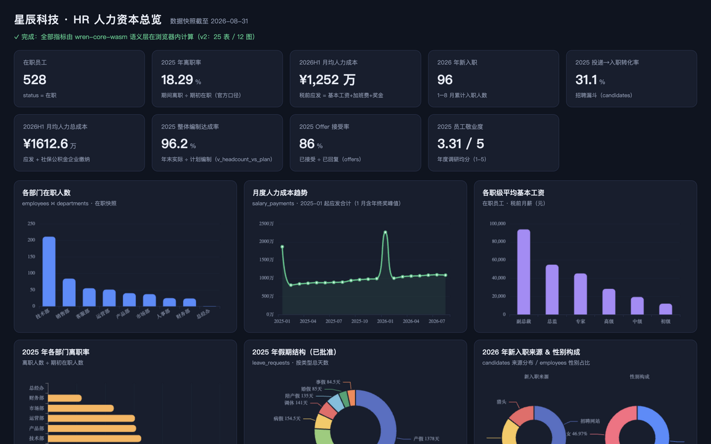
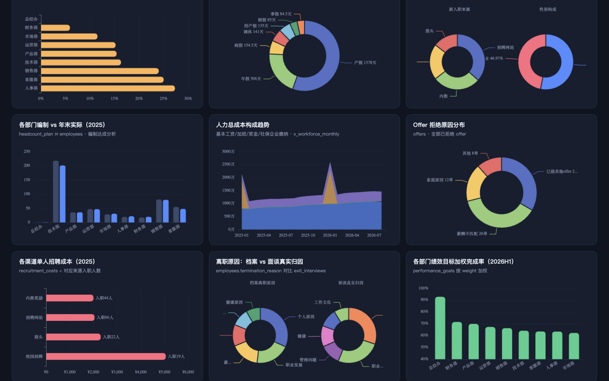

# WrenAI HR 端到端交付（v2：全业务域补齐 + 一体化验证）

以 **HR 业务场景**为例，基于 **WrenAI（2026 新架构：agent 驱动的 GenBI 引擎）** 完成的端到端交付与验证。
v2 按 [`GOAL.md`](GOAL.md) 完成 **HR 八大业务域数据补齐 → 语义层完善 → 端到端验证一体化整合**。

复刻到其他业务项目：[完整操作流程 README](docs/replication/README.md)（含 ASCII 操作表、终端命令、Agent 指令和逐步验收标准）。

智能层由 coding agent（GLM）承担，Wren 提供 **MDL 语义层 + 治理校验 + 语义记忆**，全程无需任何外部 LLM API Key。

> 演示公司：星辰科技（虚构）。员工/薪资/考勤/招聘/绩效等数据均为程序生成仿真数据（基线种子 42 + 扩展种子 2026，可完全复现）。

---

## 1. 交付物总览（v2）

| 交付物 | 位置 | 说明 |
|---|---|---|
| HR 业务数据库 | `db/` | PostgreSQL 16（Docker），**25 张表 / 25.3 万行**，覆盖八大业务域 |
| 语义层项目 | `wren-project/` | MDL：**25 模型 + 32 关系 + 6 视图 + 6 cube** + 口径规则 v2 + 词汇表 v2 + 语义记忆（142 条查询） |
| 端到端验证 | `validation/v2/` | **41 题双路径自动比对，41/41 PASS，P0 口径题 11/11**，一键回归 `run_all.py` |
| GenBI 仪表盘 | `wren-project/apps/hr-overview/` | 浏览器端 wasm 语义引擎，**9 KPI + 12 图**，本地预览 <http://127.0.0.1:8317> |
| 目标文档 | `GOAL.md` | v2 目标（范围/口径/DoD），已全部验收 |




## 2. HR 八大业务域 → 数据与语义覆盖

| 业务域 | 表（✅=v2 新增） | 关键指标（验证题号） |
|---|---|---|
| 组织与编制 | departments；✅headcount_plan | 编制达成率 96.2%（q13/q15） |
| 员工全生命周期 | employees、transfers；✅promotions、✅contracts | 晋升率/幅度（q16/q17）、90天到期合同 18 份（q18） |
| 薪酬福利 | salary_payments；✅salary_changes、✅insurance_payments、✅awards_penalties | 调薪渗透率 54.4%（q19）、人力总成本（q21）、奖惩对比（q22） |
| 考勤假期 | attendance_records、leave_requests；✅overtime_requests、✅leave_balances | 加班审批通过率（q24）、年假使用率（q26/q27） |
| 招聘用工 | job_openings、candidates、interviews；✅offers、✅recruitment_costs | Offer 接受率 86.0%（q28）、单人招聘成本 ¥2,448（q30） |
| 绩效发展 | performance_reviews、training_records；✅performance_goals、✅talent_pool | 目标加权完成率（q31/q32）、人才池（q33） |
| 员工关系 | ✅engagement_surveys、✅exit_interviews | 敬业度 3.31（q34）、真实离职原因（q35）、低敬业度追踪 40.2% vs 19.5%（q36） |
| 人效分析 | （分析层：视图+cube 承载） | 月均人力总成本 ¥1,612.6 万（q37）、主动/被动离职率 15.37%/2.93%（q39）、人均月成本 Top5（q40） |

## 3. 架构

```
用户 (自然语言 HR 提问)
   → 智能层: AI Agent (GLM) —— memory fetch/recall 取回上下文与相似查询
   → 治理层: Wren 语义层 —— MDL(模型/关系/计算列/视图/cube) + dry-plan 校验
              + knowledge/rules 官方口径 + 语义记忆(LanceDB)
   → 数据层: PostgreSQL 16 (Docker: wrenai-hr-pg:25432, hr_demo, 25 表)
GenBI 仪表盘: wren-core-wasm 在浏览器加载同一份 MDL + 25 张 parquet 快照,
              9 KPI + 12 图全部客户端计算, 无后端、无数据外发
```

## 4. 端到端验证（v2 一体化）

- 题库 41 题（基线回归 13 + 扩展 28），覆盖 9 个业务域；每题双路径：**A**=psql 直连物理表（标准答案）、**B**=agent 基于 MDL/视图/口径写 SQL 经 `wren` 语义层执行，自动逐值比对
- 结果 **41/41 PASS**，P0 口径题 11/11（离职率、编制达成率、调薪渗透率、人力总成本、加班审批、Offer 接受率、真实离职原因、月均总成本、主动/被动离职率）
- 一键回归：`python3 validation/v2/run_all.py`（支持 `--only qXX` / `--domain 人效分析`），输出 `summary.csv` + 明细 `results/`
- 明细与治理分析：[`validation/v2/matrix_v2.md`](validation/v2/matrix_v2.md)；Phase 1 矩阵：[`validation/matrix.md`](validation/matrix.md)

## 5. 快速复现

```bash
# 0) 依赖: Docker Desktop + Python 3.12 (仓库根 .venv 已含 wrenai 0.13.4)
cd wrenai-hr

# 1) 起数据库并灌数据 (25 表)
docker run -d --name wrenai-hr-pg -e POSTGRES_DB=hr_demo -e POSTGRES_USER=hr \
  -e POSTGRES_PASSWORD=hr_demo_2026 -p 25432:5432 -v wrenai-hr-pgdata:/var/lib/postgresql/data \
  postgres:16-alpine
cd hr-delivery/db && python3 seed/gen_hr_data.py && python3 seed/gen_hr_data_ext.py && ./load.sh

# 2) 语义层: 构建 + 记忆索引
cd ../wren-project && export $(grep -v '^#' .env | xargs)
../../.venv/bin/wren context validate && ../../.venv/bin/wren context build
../../.venv/bin/wren memory index

# 3) 一键端到端验证 (41 题)
cd ../validation/v2 && python3 run_all.py

# 4) 仪表盘本地预览
cd ../../wren-project/apps/hr-overview && python3 -m http.server 8317
# 打开 http://127.0.0.1:8317
```

## 6. 演示脚本（约 15 分钟）

1. **问数**："2025 各部门编制达成率" → `wren memory recall` 命中已沉淀查询 → `wren query` 出数与矩阵一致
2. **口径**：`knowledge/rules/general.md` v2——离职率/编制达成率/调薪渗透率/Offer 接受率都是治理过的官方口径
3. **治理**：`wren dry-plan` 拦截错列查询；讲述 DECIMAL 规划缺陷的发现与处理（见 matrix_v2）
4. **Cube**：`wren cube query --cube attrition --measures leaver_count --dimensions dept_name --time-dimension "termination_date:year"`
5. **仪表盘**：<http://127.0.0.1:8317>——9 KPI + 12 图，浏览器端语义层计算，数据不出本机
6. **沉淀**：`knowledge/sql/` 41 组已验证 NL→SQL 版本化；`validation/v2/summary.csv` 一键回归报告

## 7. 已知事项（引擎限制，均记录于 matrix_v2.md）

- **wren-core 0.7.6 DECIMAL 规划缺陷**: MDL DECIMAL 列在规划期退化为 Utf8（CLI 与 wasm 同根源）。
  处理: 项目 MDL 数值类型统一 DOUBLE（与 parquet 对齐，PG 执行不受影响）；
  `promotions.raise_pct` 计算列改为查询时计算，`contracts.is_expiring_soon`（无数值算术）保留计算列。
- **视图内列算术不可规划**: 视图只做关联投影，算术在查询/cube 聚合层完成。
- **`wren memory store` 中文 slug 缺陷**: 中文问题生成的文件名残缺；已全部按题目 ID 归档 `knowledge/sql/`。
- 仪表盘为本地快照模式；公网部署需用户自己的 Vercel/Cloudflare token（`wren genbi deploy`）。
- 数据为仿真数据，规律按 HR 常识建模（敬业度低→流失率高、S/A 绩效易晋升、内推成本最低等），用于演示口径与链路。

## 8. 目录结构

```
wrenai-hr/
├── hr-delivery/               # ★ 交付
│   ├── GOAL.md                # v2 目标（已全部验收）
│   ├── README.md              # 本文档
│   ├── db/                    # schema.sql(25表) / load.sh / gen_hr_data.py(基线) / gen_hr_data_ext.py(扩展)
│   ├── wren-project/          # Wren 语义层项目
│   │   ├── models/            # 25 个模型 (中文描述+计算列)
│   │   ├── views/             # 6 个视图
│   │   ├── cubes/             # workforce / labor_cost / recruitment / attrition / headcount_plan_cube / total_cost
│   │   ├── relationships.yml  # 32 条关系
│   │   ├── knowledge/         # rules(口径v2) / glossary(词汇v2) / sql(41 组 NL→SQL)
│   │   ├── apps/hr-overview/  # GenBI 仪表盘 (index.html + mdl.json + data/*.parquet ×25)
│   │   └── target/mdl.json    # 编译产物
│   ├── validation/            # Phase 1 矩阵 + groundtruth.sql + run_wren.sh
│   │   └── v2/                # ★ 一体化验证: questions.py(41题) / run_all.py / matrix_v2.md / summary.csv / results/
│   └── docs/                  # dashboard-v2-*.png
├── vendor/WrenAI/             # 上游仓库克隆 (参考用, 未修改)
└── .venv/                     # wrenai 0.13.4 + postgres + memory extras
```
